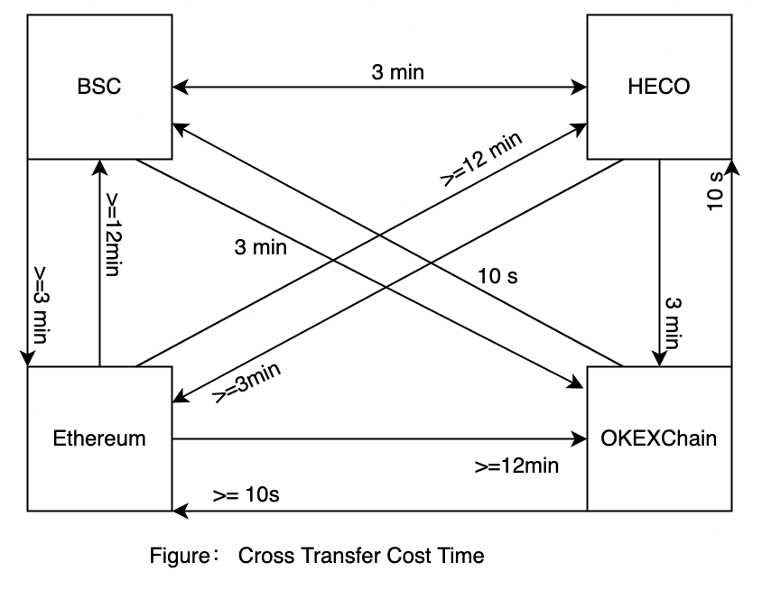

Author: [ZeroOne Team](https://01.finance/) Version: 0.1

## 摘要

Hotpot 是一种无损跨链兑换的去中心化解决方案，由一组持久、不可升级的智能合约来实现。旨在帮助用户（包括合约）在多链环境中，便捷、快速、安全地跨链兑换资产。具有去中心化、用时短、成本低和零滑点等特性。最终，Hotpot 将服务于有跨链需求的 DeFi 实现可编程跨链。

## 为什么需要 Hotpot？

当 Flux 需要实现跨链借贷时，对已流行的资产跨链协议，都无法满足 Flux 需求。为了支持 Flux 跨链借贷，ZeroOne 团队自行研发资产跨链协议。通过以下两方面对比解释 Hotpot 要解决的问题。

### Hotpot vs AMM

当前市面上已存在的资产跨链兑换 DeFi（如 AnySwap、O3）均基于 AMM 架构设计，需要市场创建交易对和注入流动性，token 定价完全由 `x*y=K`  恒定乘积决定。

大额订单会严重影响被购买 token 的价格。假设您想用 10 万个 DAI 购买 100 个ETH —— 当订单执行时，因为流动性不足，您的兑换将拉高 ETH 的价格，最终只能用10万个DAI购买80个ETH（或更少）。这是该恒定乘积算法的工作原理使然。如果流动性低，即使很小的订单，也很容易导致滑点产生。

流动性是兑换交易的关键。为了解决流动性问题，Hotpot 将从 [Flux](https://flux.01.finance) 中信用借款（无抵押借款）。跨链兑换时，如果流动性不足将自动从 Flux 中借款来弥补流动性。当流动性充足时（或任意时候）Hotpot 随时向 Flux  支付利息和偿还借款。

向 Flux 信用借款不仅可以解决流动性，也能提高 Flux 借贷资金利用率。

同时， Hotpot 也允许任意地址提供流动性，获得流动性激励。将以单币形式提供流动性，流动性提供者无需承担无偿风险，零风险赚取流动性激励收益。

### Hotpot vs 资产充提

假设您急需将 BSC 链上的 100 ETH 跨链到 OEX 链钱包，以参与头矿、补仓等交易。那么，你只能是将 BSC 100 ETH 充值到币安交易所，然后再从币安交易所提现到 OKEX 交易所，最后从 OKEX 交易所提币到 OEX 链钱包中。该过程极其耗时（超过 20 分钟），并且前提是您已拥有交易所交易账户。否则，为了充提资产，您需要注册交易账户，并完成 KYC 认证。


为了提供便捷的资产跨链，Hotpot 无需复杂耗时的操作，一键操作即可 3.5 分钟完成资产跨链，无需 KYC，告别繁琐。

这依赖与 Hotpot 在每条公链都拥有足够的流动性，并通过去中心化跨链桥协议快速完成资产跨链。

## 协议

### 系统架构


1. **LP** : 流动性提供者，FluxV1 提供信用借款来弥补流动性，任意地址可以为 Hotpot 提供流动性。
2. **Gateway** : 负责处理跨链兑换交易，并通过跨链桥传递消息。
3. **Vault** ：  Token 金库，为每个 token 独分配金库。流动性提供者提供的 token 也将在 vault 中保管，无人能直接动用该金库。
4. **Cross Bridge**: 跨链桥，跨链兑换需要通过跨链桥将跨链兑换订单信息传递到目标链中，以便在目标链中完成资产释放。


### 资产 Token

Hotpot 早期流动性由 FluxV1 提供，因此早期所支持的跨链资产受FluxV1借贷池限制。首批支持的资产主要是主流Token： USDT、USDC、DAI 、 BTC 、ETH。 首个版本将只支持上述 Token 同币种 1:1 跨链兑换。

通过Hotpot，只需要支付极少的交易费便可将上述资产一键跨出到目标链中，交易时间取决于公链的交易确认速度。从 BSC 链转账 ETH 到 OKEXChain 链只需 3.5 分钟。

| 链        | 跨链桥等待交易确实时长 |
| --------- | ---------------------- |
| Ethereum  | 12个区块，10分钟       |
| BSC       | 21个区块，63秒         |
| HECO      | 21个区块，63秒         |
| OKEXChain | 21个区块， 63秒        |



### 流动性

Hotpot 流动性由多方提供，流动性提供者可以是个人钱包，也可以是机枪池。为解决 Hotpot 上线早期的流动性问题，将从 FLUXV1 信用借款自动弥补流动性，当流动性不足时将从FluxV1信用借款，有新流动性加入时将自动还款并支付利息。

借款利息将由流动性提供者均摊，均摊成本由跨链兑换手续费和借款时长决定。流动性提供者的收益计算如下：

```
流动性提供者收益=    跨链手续费分成激励 + FLUX 借款挖矿收益 - 借款年利率 * 跨链数量 * 时长
```

其中跨链手续分成激励包含用户以 FLUX 支付的部分交易手续费。

假设，USDT 借款年利率为 13%，借款挖矿收益率 8.25%，跨链手续费分成 0.21%， 在12小时内还款则有：

```
流动性提供者收益 = 数量 * 0.21% + 跨链数量*8.25%/365*0.5  - 跨链数量 * 13%/365 * 0.5 =  跨链数量 * 0.20349315%
```

最终，流动性提供者的收益将由交易额决定，资金使用率越高，收益越高。

> 注意，FluxV1 对 hotpot 以借款方式提供流动性，单币初始信用额度为 $100万，额度使用完毕将无法继续信用借款。

### 跨链交易

用户将持有资产通过hotpot跨出兑换到目标链中，由跨链桥负责传递跨链信息。


假设张三从 A链跨链兑换 10 BTC 到 B  链：

1. 10 BTC 流入 A链 Hotpot BTC 金库。
2. A  链 Hotpot 发送跨链兑换消息 （ From：张三、To: 张三、SourceChain：A 链、TargetChain: B 链、Amount：10 BTC 、Fee : 0.03 BTC）
3. Bridge 将监听接收到跨链消息后，将自动在 B链触发兑换。
4. B链 Hotpot 验证兑换消息后，从 BTC 金库中转账 10-0.03 BTC 给张三。一些特殊情况下，当 BTC 金库流动性不足以转账时，该订单将属于Pending状态，等待流动性充足时自动继续转账。

### 交易手续费

需要支付两部分手续费才能将资产一键跨链兑换到其他链中，这两部分手续费分别是：

1. **过桥手续费**：由跨链桥基础设施收取的跨链手续费，用于在目标链中执行跨链交易，使用公链平台币(如 BSC 链的 BNB)支付。

  ```
  过桥费=  目标链交易Gas费* 目标链平台币价格 / 源链平台币价格 * 1.2
  ```


1. **兑换交易手续费**：

   由hotpot平台收取的交易手续费，默认使用Flux支付，也可以使用跨链资产支付，大部分作为流动性提供者费用奖励给流动性提供者。

   1. Hotpot上线初期，允许使用Flux支付（8折优惠），收取 2.4‰ 手续费，等于`跨链数量*跨链资产价格*0.0024/FLUX价格`。
   2. 使用跨链资产支付，将收取 3 ‰ 手续费 `跨链数量*跨链资产价格*0.003`。

    hotpot 收取到兑换手续费中30%归hotpot团队所有，70%按比例分给为hotpot流动性提供者。


### 流动性调仓

当挤兑或某链DeFi火爆时容易造成不同链之间的流动性失衡。为了尽可能的恢复平衡，Hotpot将监控各链的流动性情况，通过垫付资金方式调整流动性。根据过去 12 小时内每条链的跨链交易额来确定每条链理想流动性分配比例。

比如过去 12 小时中，USDC 在 OEC、BSC、HECO 的交易额为 5 万、6 万、9 万。因此可以简单预测 OEC、BSC 和 HECO 上的流动性应该保持 0.25 : 0.3 : 0.45 分配比，以满足未来 12 小时的 USDC 在各链中的流动性。


### 跨链桥与风险防范

由跨链桥基础设施负责从 Chain X 到 Chain Y 传递跨链事件。为了寻找满足 Hotpot 的资产跨链需求，当前从已知的主流跨链桥中，选择 ChainLink、AnySwap 和 Poly 来充当 Hotpot 的跨链桥。

Hotpot 不直接信任单一跨链桥，采用混用、二次确认的方式来避免单一跨链桥作恶（或漏洞利用攻击）。Hotpot 的跨链事件要求至少两个跨链桥分别确认才能被视为合法跨链。

同时，为了防止部分跨链桥故障，引起无法完成二次确认。Hotpot 会实时监控，并在一定条件下激活允许备用服务，辅助二次确认。

### 可编程跨链

Hotpot 的梦想时，在多链时代，帮助 DeFi 开发者快速、安全的实现跨链开发。将为 DeFi 开发者提供统一的跨链交互API（内置各种主流跨链协议）。DeFi开发者无需担心跨链桥单节点故障，并支持在多个跨链桥中无缝切换。

以 Flux 跨链借贷场景为起点，探索和完善跨链场景，为 DeFi 可编程跨链提供基础服务支撑，为 DeFi 提供跨链SDK，包括 NPM Package，也包括跨链智能合约协议包。

## 发展路线

- [x]  v1: 主流 Token 跨链兑换
- [ ] v2: 支持任意 Token 跨链兑换
- [ ] v3: 支持任意 DeFi 可编程跨链