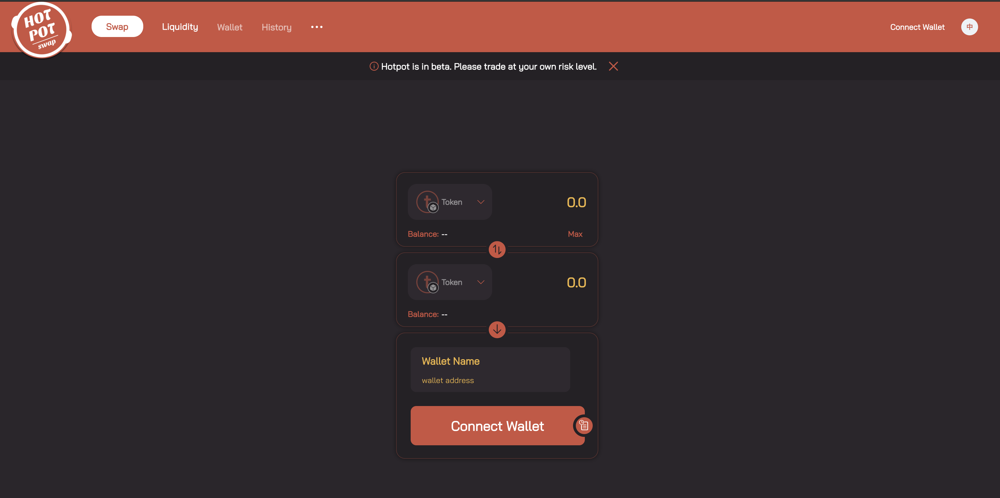
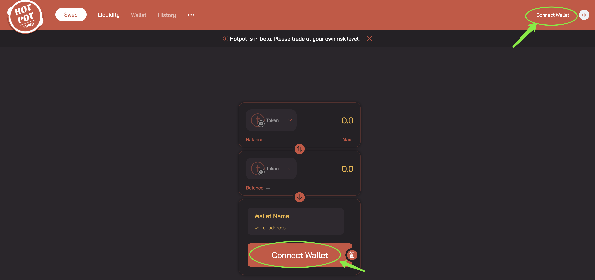
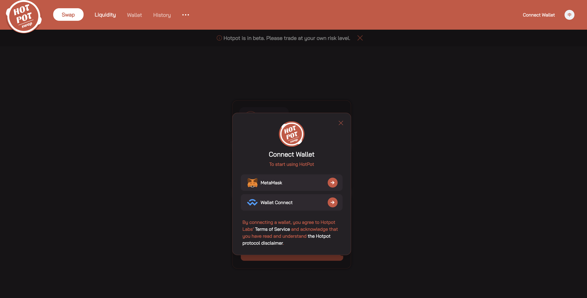
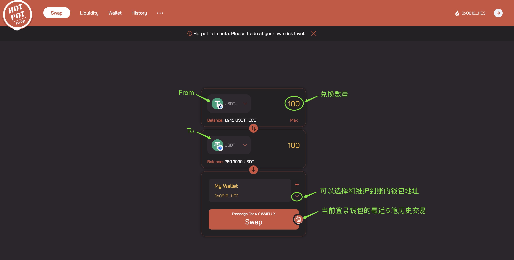
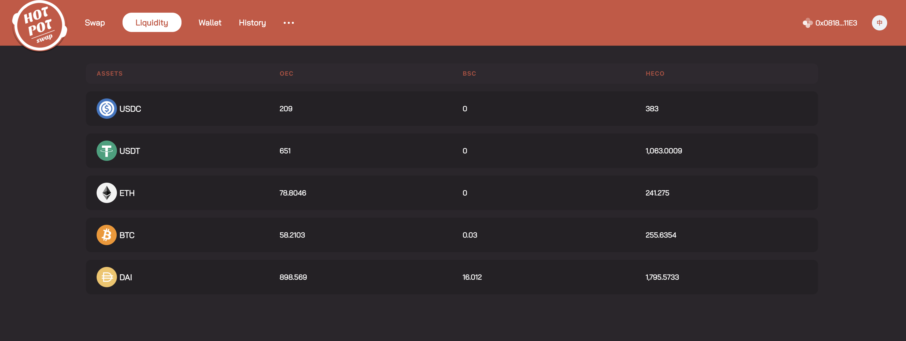
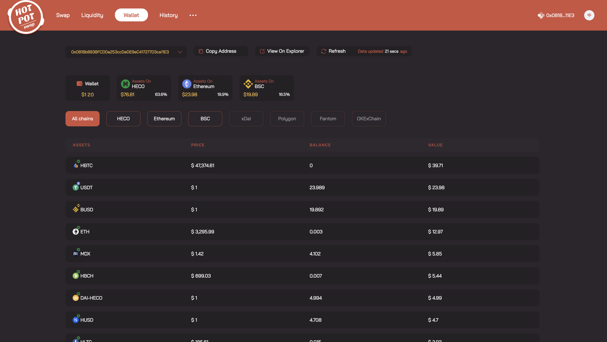
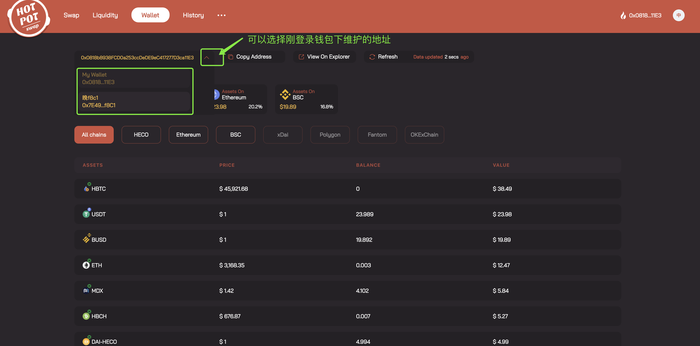
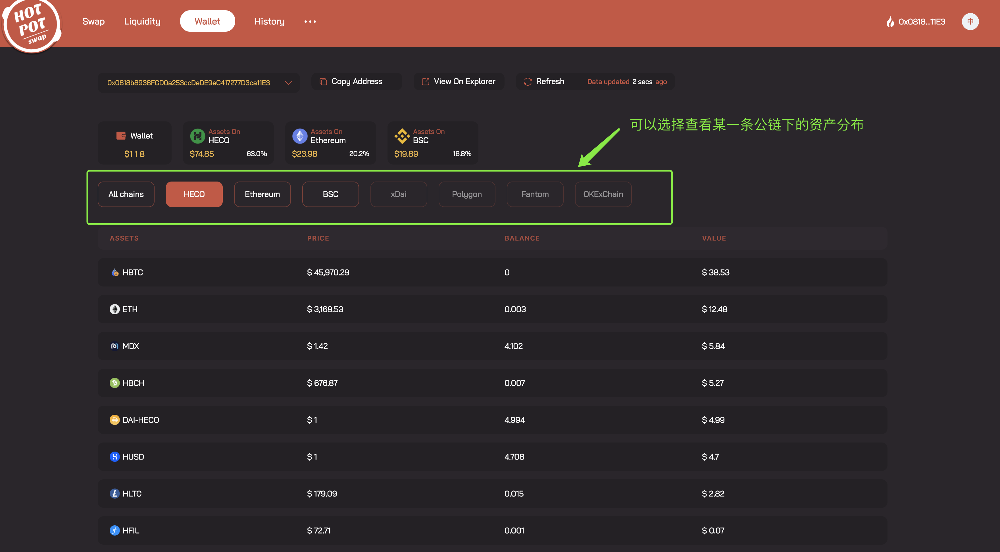
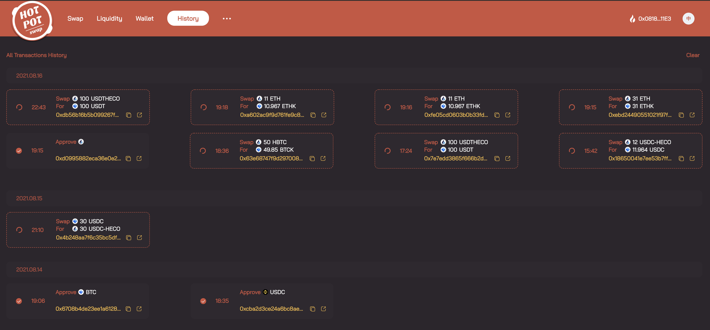
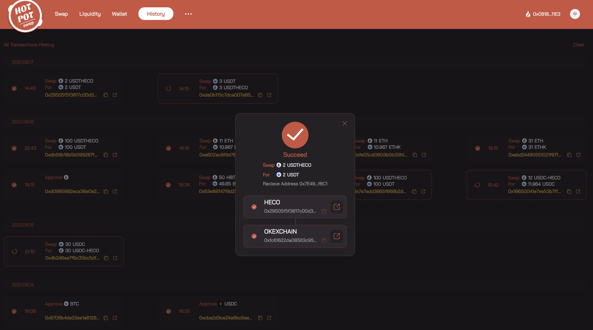

#**HotPot用户操作手册**

------

# 1.简介
## 1.1简介

Hotpot 是一种无损跨链兑换的去中心化解决方案，由一组持久、不可升级的智能合约来实现。旨在帮助用户（包括合约）在多链环境中，便捷、快速、安全地跨链兑换资产。具有去中心化、用时短、成本低和零滑点等特性。最终，Hotpot 将服务于有跨链需求的 DeFi 实现可编程跨链。

## 1.2特色
1.无损跨链交易：零滑点
2.流动性充足、灵活:Hotpot 将从 [Flux](https://flux.01.finance/) 中信用借款,跨链兑换时，如果流动性不足将自动从 Flux 中借款来弥补流动性。
3.用时短成本低:Hotpot 无需复杂耗时的操作，一键操作即可 3.5 分钟完成资产跨链，无需 KYC，告别繁琐。

# 2.功能
## 2.1 Swap

HotPot 允许用户将多个已支持的公链中将资产跨出到其他公链中，并且是无损的。即使用户没有登录也能够选择资产和输入跨出数量，只是无法进行交易操作而已。兑换关系由 hotpot系统设定，主要保证能1:1兑换，消除磨损。

**第1步：来到Swap页面**

HotPot的首页即为Swap页面（[https://app.hotpot.cool](https://app.hotpot.cool/)）

**第2步：连接钱包**

1.点击Connect Wallet，弹出钱包选择面板，现在HotPot支持的钱包有 MetaMash 和 Wallet Connect

2.选择钱包之后唤醒钱包，选择账户（即你跨出资产的钱包地址），确认连接之后即可登录钱包

**第3步：Swap**
1. 选择From和To的资产、To的钱包地址，输入要兑换的数量，即可看到预估所需的总费用

   ps：（1）HotPot前期支持跨链的公链有：HECO、BSC、OEC

   ​       （2）HotPot前期支持的跨链资产有：ETH、BTC、USDT、USDC、DAI

	​	   （3）HotPot前期支持的暂时只支持同币种跨链兑换

   ​       （4）From为当前登录的钱包地址；To默认为当前登录钱包地址，支持选择已维护的钱包地址

2. 点击【Swap】，进入交易确认页，展示到账资产的数量和价值、费用明细等，Exchange Fee默认使用Flux支付（八折优惠），也可以选择本币支付

3. 点击【Confirm To Swap】，唤醒钱包并确认交易，进入交易等待页。可以随时在浏览器查询交易状态

4. 等待交易成功之后，即完成Swap，你就可以到To的钱包地址查看到账的资产

## 2.2 Liquidity

Hotpot 的流动性由FluxV1提供，解决滑点问题。

点击顶部菜单的 Liquidity，即可进入流动性页面，你可以查看HotPot当前支持的资产在各个公链的流动性。

## 2.3 Wallet

钱包资产，聚合展示账户在多链的资产分布信息，可以方便你查阅。

1. 你可以选择当前登录钱包下维护的钱包地址，查看该地址下的资产分布
2. 默认显示所有链的资产分布，你也可以选择某一条公链查看其资产分布

## 2.4 History

历史交易记录：在这里，你还可以看到当前登录钱包的所有历史交易记录，也可以查看Swap类型交易的详情。

