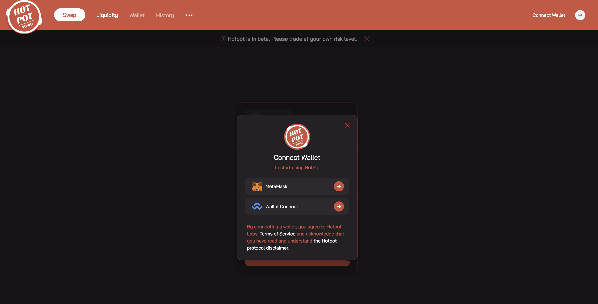
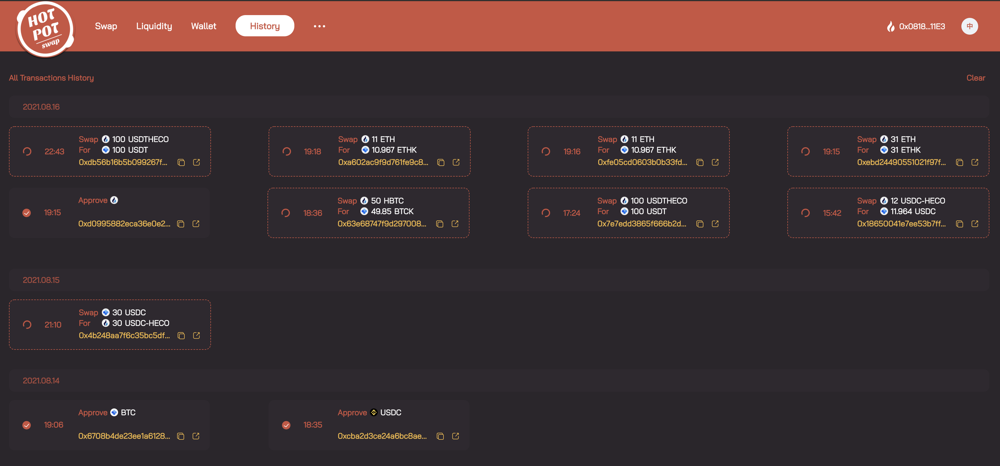

## 跨链兑换 {#swap}

Hotpot 允许用户将多个已支持的公链中将资产跨出到其他公链中，并且是无损的。兑换关系由 Hotpot 系统设定，主要保证能 1:1 兑换，消除磨损。

### 第1步：来到Swap页面 {#swap-1}

Hotpot的首页即为Swap页面（[https://app.Hotpot.cool](https://app.Hotpot.cool/)）

### 第2步：连接钱包 {#swap-2}

1. 点击Connect Wallet，弹出钱包选择面板，现在Hotpot支持的钱包有 [MetaMask](https://metamask.io/) 和 Wallet Connect

2. 选择钱包之后唤醒钱包，选择账户（即你跨出资产的钱包地址），确认连接之后即可登录钱包

### 第3步：确认兑换 {#swap-3}

1. 选择From和To的资产、To的钱包地址，输入要兑换的数量，即可看到预估所需的总费用。

>   1. Hotpot前期支持跨链的公链有：HECO、BSC、OEC
>   2. Hotpot前期支持的跨链资产有：ETH、BTC、USDT、USDC、DAI
>   3. Hotpot前期支持的暂时只支持同币种跨链兑换
>   4. From为当前登录的钱包地址；To默认为当前登录钱包地址，支持选择已维护的钱包地址

2. 点击【Swap】，进入交易确认页，展示到账资产的数量和价值、费用明细等，Exchange Fee默认使用 Flux支付（活动初期八折优惠），也可以选择本币支付。

3. 点击【Confirm To Swap】，唤醒钱包并确认交易，进入交易等待页。可以随时在浏览器查询交易状态。

4. 等待交易成功之后，即完成Swap，你就可以到To的钱包地址查看到账的资产。

## 流动性 {#liquidity}

Hotpot 的流动性由FluxV1提供，解决滑点问题。

点击顶部菜单的 Liquidity ，即可进入流动性页面，你可以查看Hotpot当前支持的资产在各个公链的流动性。

## 钱包  {#wallet}

钱包资产，聚合展示账户在多链的资产分布信息，可以方便你查阅。

1. 你可以选择当前登录钱包下维护的钱包地址，查看该地址下的资产分布
2. 默认显示所有链的资产分布，你也可以选择某一条公链查看其资产分布

## 历史交易 {#history}

历史交易记录：在这里，你还可以看到当前登录钱包的所有历史交易记录，也可以查看Swap类型交易的详情。

