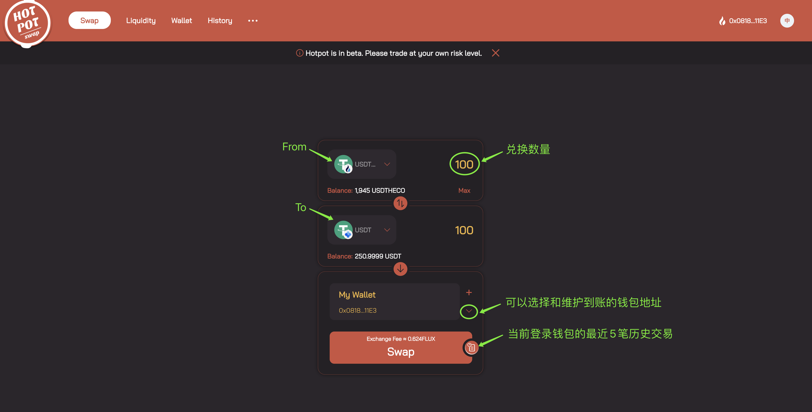
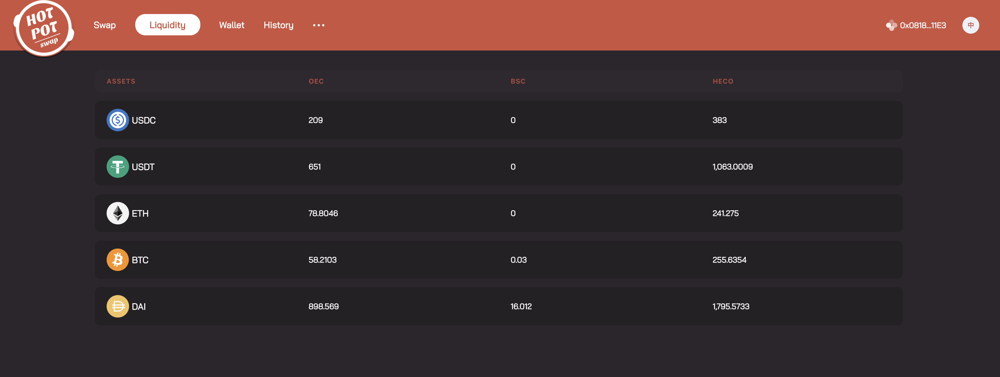

## Cross-chain swap {#swap}

Hotpot Protocol allows users to cross-chain swap their assets seamlessly between selected blockchain networks without the need to bear any losses. Even if a user did not connect their wallet they can select the assets and the amount to be cross-chained, but it cannot be processed. The swap relationship is set by the Hotpot Protocol and promises a 1:1 cross-chain swap.

### Step 1: Open the website {#swap-1}

Hotpot Protocol’s webpage is set as the Swap page([https://app.hotpot.cool](https://app.hotpot.cool/))

### Step 2: Connect your wallet {#swap-2}

1. Click on “Connect Wallet”, a pop-up window will appear to choose a supported wallet ( [MetaMask](https://metamask.io/) and Wallet Connect).

2. After connecting your wallet, choose the account with the cross-chain assets and confirm the connection to HotPot Protocol.

### Step 3: Confirm Swap {#swap-3}

1. Select your to be cross-chain swapped asset in "From" and "To", and input the amount. The estimated transaction fees will be shown.

>   1. Supported networks: HECO, BSC, OEC.
>   2. Supported assets: ETH, BTC, USDT, USD, DAI.
>   3. Currently, Hotpot only supports the cross-chain swap of the same assets. ( E.g.: USDT from ERC20 to BEP20).
>   4. "From" is the connected wallet, "To" is set to the same wallet address as the connected wallet by default. If you wish to select an alternative "To" address, please input the address.

1. Click "Swap" to confirm your cross-chain swap details and select the payment asset for the exchange fee. $FLUX is selected as default exchange fee asset with a 20% discount, but the cross-chain asset can be chosen.

2. Click "Confirm Swap", a pop-up window will appear, and confirm the transaction.

3. After the cross-chain swap is successfully completed, you can find your cross-chain swapped asset in your "To" wallet.

## Liquidity {#liquidity}

Hotpot Protocol's initial liquidity is provided by Flux V1 to eliminate slippage.

In the Liquidity tab (in the top menu on the website) the liquidity of all assets on the various networks can be monitored.

## Wallet  {#wallet}

In the Wallet tab (in the top menu on the website), the assets in the connected wallet on Hotpot’s supported networks are shown.

1. The assets of the connected wallet are shown.
2. By default, the assets of the connected wallet on all networks are shown. You can choose to view the assets on specific networks.

## Cross-chain swap history {#history}

In the History tab (in the top menu on the website), you can find all historical cross-chain swaps of the connected account and more detailed information.

